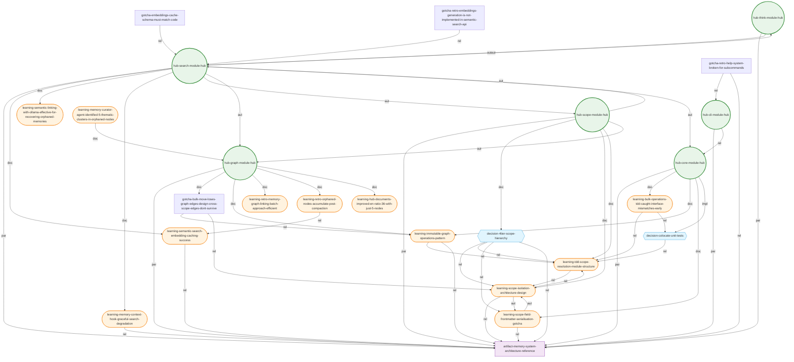

```mermaid
flowchart TB
  learning-tdd-scope-resolution-module-structure(["learning-tdd-scope-resolution-module-structure"])
  learning-scope-field-frontmatter-serialisation-gotcha(["learning-scope-field-frontmatter-serialisation-gotcha"])
  learning-scope-isolation-architecture-design(["learning-scope-isolation-architecture-design"])
  learning-immutable-graph-operations-pattern(["learning-immutable-graph-operations-pattern"])
  learning-semantic-search-embedding-caching-success(["learning-semantic-search-embedding-caching-success"])
  decision-4tier-scope-hierarchy{{"decision-4tier-scope-hierarchy"}}
  learning-memory-context-hook-graceful-search-degradation(["learning-memory-context-hook-graceful-search-degradation"])
  learning-retro-memory-graph-linking-batch-approach-efficient(["learning-retro-memory-graph-linking-batch-approach-efficient"])
  decision-colocate-unit-tests{{"decision-colocate-unit-tests"}}
  learning-bulk-operations-tdd-caught-interface-mismatches-early(["learning-bulk-operations-tdd-caught-interface-mismatches-early"])
  gotcha-bulk-move-loses-graph-edges-design-cross-scope-edges-dont-survive["gotcha-bulk-move-loses-graph-edges-design-cross-scope-edges-dont-survive"]
  learning-retro-orphaned-nodes-accumulate-post-compaction(["learning-retro-orphaned-nodes-accumulate-post-compaction"])
  artifact-memory-system-architecture-reference["artifact-memory-system-architecture-reference"]
  hub-cli-module-hub(("hub-cli-module-hub"))
  hub-core-module-hub(("hub-core-module-hub"))
  hub-graph-module-hub(("hub-graph-module-hub"))
  hub-think-module-hub(("hub-think-module-hub"))
  hub-search-module-hub(("hub-search-module-hub"))
  hub-scope-module-hub(("hub-scope-module-hub"))
  learning-semantic-linking-with-ollama-effective-for-recovering-orphaned-memories(["learning-semantic-linking-with-ollama-effective-for-recovering-orphaned-memories"])
  learning-hub-documents-improved-en-ratio-36-with-just-5-nodes(["learning-hub-documents-improved-en-ratio-36-with-just-5-nodes"])
  learning-memory-curator-agent-identified-5-thematic-clusters-in-orphaned-nodes(["learning-memory-curator-agent-identified-5-thematic-clusters-in-orphaned-nodes"])
  gotcha-embeddings-cache-schema-must-match-code["gotcha-embeddings-cache-schema-must-match-code"]
  gotcha-retro-help-system-broken-for-subcommands["gotcha-retro-help-system-broken-for-subcommands"]
  gotcha-retro-embeddings-generation-is-not-implemented-in-semantic-search-api["gotcha-retro-embeddings-generation-is-not-implemented-in-semantic-search-api"]
  decision-4tier-scope-hierarchy -->|rel| learning-scope-isolation-architecture-design
  decision-4tier-scope-hierarchy -->|rel| learning-tdd-scope-resolution-module-structure
  learning-tdd-scope-resolution-module-structure -->|rel| learning-scope-isolation-architecture-design
  learning-immutable-graph-operations-pattern -->|rel| learning-tdd-scope-resolution-module-structure
  decision-4tier-scope-hierarchy -->|rel| learning-scope-field-frontmatter-serialisation-gotcha
  learning-scope-isolation-architecture-design -->|rel| learning-tdd-scope-resolution-module-structure
  decision-colocate-unit-tests -->|rel| learning-tdd-scope-resolution-module-structure
  learning-retro-orphaned-nodes-accumulate-post-compaction -->|rel| learning-semantic-search-embedding-caching-success
  learning-bulk-operations-tdd-caught-interface-mismatches-early -->|rel| learning-tdd-scope-resolution-module-structure
  learning-bulk-operations-tdd-caught-interface-mismatches-early -->|rel| decision-colocate-unit-tests
  gotcha-bulk-move-loses-graph-edges-design-cross-scope-edges-dont-survive -->|rel| learning-immutable-graph-operations-pattern
  gotcha-bulk-move-loses-graph-edges-design-cross-scope-edges-dont-survive -->|rel| learning-scope-isolation-architecture-design
  learning-semantic-search-embedding-caching-success -->|rel| artifact-memory-system-architecture-reference
  learning-scope-isolation-architecture-design -->|rel| artifact-memory-system-architecture-reference
  decision-4tier-scope-hierarchy -->|rel| artifact-memory-system-architecture-reference
  learning-immutable-graph-operations-pattern -->|rel| artifact-memory-system-architecture-reference
  learning-scope-field-frontmatter-serialisation-gotcha -->|rel| artifact-memory-system-architecture-reference
  learning-memory-context-hook-graceful-search-degradation -->|rel| artifact-memory-system-architecture-reference
  hub-cli-module-hub -->|par| artifact-memory-system-architecture-reference
  hub-cli-module-hub -->|rel| hub-core-module-hub
  hub-core-module-hub -->|par| artifact-memory-system-architecture-reference
  hub-core-module-hub -->|doc| learning-bulk-operations-tdd-caught-interface-mismatches-early
  hub-core-module-hub -->|doc| learning-immutable-graph-operations-pattern
  hub-core-module-hub -->|doc| learning-scope-field-frontmatter-serialisation-gotcha
  hub-core-module-hub -->|impl| decision-colocate-unit-tests
  hub-graph-module-hub -->|par| artifact-memory-system-architecture-reference
  hub-graph-module-hub -->|doc| gotcha-bulk-move-loses-graph-edges-design-cross-scope-edges-dont-survive
  hub-graph-module-hub -->|doc| learning-immutable-graph-operations-pattern
  hub-graph-module-hub -->|doc| learning-retro-memory-graph-linking-batch-approach-efficient
  hub-graph-module-hub -->|doc| learning-retro-orphaned-nodes-accumulate-post-compaction
  hub-graph-module-hub -->|doc| learning-hub-documents-improved-en-ratio-36-with-just-5-nodes
  hub-search-module-hub -->|par| artifact-memory-system-architecture-reference
  hub-search-module-hub -->|doc| learning-semantic-search-embedding-caching-success
  hub-search-module-hub -->|doc| learning-semantic-linking-with-ollama-effective-for-recovering-orphaned-memories
  hub-search-module-hub -->|doc| learning-memory-context-hook-graceful-search-degradation
  hub-scope-module-hub -->|par| artifact-memory-system-architecture-reference
  hub-scope-module-hub -->|doc| decision-4tier-scope-hierarchy
  hub-scope-module-hub -->|doc| learning-scope-isolation-architecture-design
  hub-scope-module-hub -->|doc| learning-tdd-scope-resolution-module-structure
  hub-think-module-hub -->|par| artifact-memory-system-architecture-reference
  learning-memory-curator-agent-identified-5-thematic-clusters-in-orphaned-nodes -->|doc| hub-graph-module-hub
  gotcha-embeddings-cache-schema-must-match-code -->|rel| hub-search-module-hub
  gotcha-retro-help-system-broken-for-subcommands -->|rel| hub-cli-module-hub
  gotcha-retro-help-system-broken-for-subcommands -->|rel| artifact-memory-system-architecture-reference
  gotcha-retro-embeddings-generation-is-not-implemented-in-semantic-search-api -->|rel| hub-search-module-hub
  hub-scope-module-hub -->|aut| hub-search-module-hub
  hub-search-module-hub -->|aut| hub-scope-module-hub
  hub-think-module-hub -->|aut| hub-search-module-hub
  hub-search-module-hub -->|aut| hub-think-module-hub
  hub-search-module-hub -->|aut| hub-graph-module-hub
  learning-scope-isolation-architecture-design -->|aut| learning-scope-field-frontmatter-serialisation-gotcha
  learning-scope-field-frontmatter-serialisation-gotcha -->|aut| learning-scope-isolation-architecture-design
  hub-scope-module-hub -->|aut| hub-graph-module-hub
  hub-search-module-hub -->|aut| hub-core-module-hub

  classDef learning fill:#fff3e0,stroke:#f57c00
  classDef decision fill:#e1f5fe,stroke:#0288d1
  classDef artifact fill:#f3e5f5,stroke:#7b1fa2
  classDef hub fill:#e8f5e9,stroke:#388e3c,stroke-width:3px
  class learning-tdd-scope-resolution-module-structure,learning-scope-field-frontmatter-serialisation-gotcha,learning-scope-isolation-architecture-design,learning-immutable-graph-operations-pattern,learning-semantic-search-embedding-caching-success,learning-memory-context-hook-graceful-search-degradation,learning-retro-memory-graph-linking-batch-approach-efficient,learning-bulk-operations-tdd-caught-interface-mismatches-early,learning-retro-orphaned-nodes-accumulate-post-compaction,learning-semantic-linking-with-ollama-effective-for-recovering-orphaned-memories,learning-hub-documents-improved-en-ratio-36-with-just-5-nodes,learning-memory-curator-agent-identified-5-thematic-clusters-in-orphaned-nodes learning
  class decision-4tier-scope-hierarchy,decision-colocate-unit-tests decision
  class artifact-memory-system-architecture-reference artifact
  class hub-cli-module-hub,hub-core-module-hub,hub-graph-module-hub,hub-think-module-hub,hub-search-module-hub,hub-scope-module-hub hub
```
