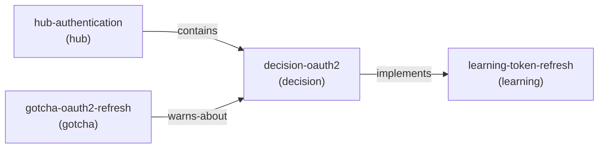

# Contract: Memory Skill API

**Feature**: 001-memory-plugin
**Created**: 2026-01-10
**Type**: TypeScript Interfaces
**Purpose**: Define the public API surface for the memory skill

---

## Core CRUD Operations

### Write Memory

**Operation**: `memory write <content> [options]`

**Input**:
```typescript
interface WriteMemoryRequest {
  content: string;                    // Memory content (markdown)
  title?: string;                     // Title (extracted from content if missing)
  type: MemoryType;                   // Memory type
  tags: string[];                     // Categorisation tags
  scope?: Scope;                      // Storage scope (defaults to auto)
  links?: string[];                   // Initial links to other memories
}
```

**Output**:
```typescript
interface WriteMemoryResponse {
  success: boolean;
  slug: string;                       // Generated slug
  filePath: string;                   // Absolute path to memory file
  scope: Scope;                       // Actual scope used
  created: string;                    // ISO 8601 timestamp
  message: string;                    // Human-readable confirmation
}
```

**Errors**:
- `InvalidTypeError`: Type not in MemoryType enum
- `InvalidTagsError`: Tags empty or malformed
- `ScopeNotAvailableError`: Requested scope not available (e.g., enterprise disabled)
- `FileWriteError`: Filesystem write failed

**Example**:
```typescript
// Human-readable output
memory write "Decided to use OAuth2 with PKCE" --type decision --tags auth,oauth2

// Success:
✓ Memory created: decision-oauth2
  Scope: global
  Path: /home/user/.claude/memory/decision-oauth2.md
  Created: 2026-01-10T10:00:00Z

// JSON output (--json flag)
{
  "success": true,
  "slug": "decision-oauth2",
  "filePath": "/home/user/.claude/memory/decision-oauth2.md",
  "scope": "global",
  "created": "2026-01-10T10:00:00Z",
  "message": "Memory created: decision-oauth2"
}
```

---

### Read Memory

**Operation**: `memory read <slug> [options]`

**Input**:
```typescript
interface ReadMemoryRequest {
  slug: string;                       // Memory identifier
  scope?: Scope;                      // Specific scope to search (defaults to all)
  format?: "markdown" | "json";       // Output format
}
```

**Output**:
```typescript
interface ReadMemoryResponse {
  success: boolean;
  memory: Memory;                     // Full memory object
  scope: Scope;                       // Scope where found
}

interface Memory {
  slug: string;
  title: string;
  type: MemoryType;
  tags: string[];
  created: string;
  updated: string;
  links: string[];
  content: string;                    // Markdown body
  scope: Scope;
  filePath: string;
}
```

**Errors**:
- `MemoryNotFoundError`: Slug not found in any accessible scope
- `InvalidSlugError`: Slug format invalid

**Example**:
```typescript
memory read decision-oauth2

// Success (human-readable):
─────────────────────────────────────
decision-oauth2 [global]
─────────────────────────────────────
Type: decision
Tags: auth, oauth2, security
Created: 2026-01-10T10:00:00Z
Updated: 2026-01-10T10:30:00Z
Links: learning-token-refresh, hub-authentication
─────────────────────────────────────

# OAuth2 Implementation Decision

We decided to use OAuth2 with PKCE flow...
```

---

### List Memories

**Operation**: `memory list [options]`

**Input**:
```typescript
interface ListMemoriesRequest {
  type?: MemoryType;                  // Filter by type
  tags?: string[];                    // Filter by tags (OR logic)
  scope?: Scope | "all";              // Filter by scope
  sortBy?: "created" | "updated" | "title";
  sortOrder?: "asc" | "desc";
  limit?: number;                     // Max results
  offset?: number;                    // Pagination offset
  format?: "table" | "json";
}
```

**Output**:
```typescript
interface ListMemoriesResponse {
  success: boolean;
  memories: MemorySummary[];
  total: number;                      // Total matching (before limit/offset)
  filters: AppliedFilters;
}

interface MemorySummary {
  slug: string;
  title: string;
  type: MemoryType;
  tags: string[];
  created: string;
  updated: string;
  scope: Scope;
  linkCount: number;                  // Number of edges
}

interface AppliedFilters {
  type?: MemoryType;
  tags?: string[];
  scope?: Scope;
}
```

**Example**:
```typescript
memory list --type decision --tags auth

// Success (table format):
┌─────────────────────┬─────────────────────────────┬──────────┬─────────────┬─────────────────────┐
│ Slug                │ Title                       │ Type     │ Scope       │ Updated             │
├─────────────────────┼─────────────────────────────┼──────────┼─────────────┼─────────────────────┤
│ decision-oauth2     │ OAuth2 Implementation       │ decision │ [global]    │ 2026-01-10T10:30:00 │
│ decision-auth-flow  │ Authentication Flow Choice  │ decision │ [project]   │ 2026-01-09T15:20:00 │
└─────────────────────┴─────────────────────────────┴──────────┴─────────────┴─────────────────────┘

Total: 2 memories (filtered by type=decision, tags=auth)
```

---

### Delete Memory

**Operation**: `memory delete <slug> [options]`

**Input**:
```typescript
interface DeleteMemoryRequest {
  slug: string;
  scope?: Scope;                      // Specific scope (defaults to auto-detect)
  force?: boolean;                    // Skip confirmation (default: false)
}
```

**Output**:
```typescript
interface DeleteMemoryResponse {
  success: boolean;
  slug: string;
  scope: Scope;
  edgesRemoved: number;               // Graph edges cleaned up
  cacheRemoved: boolean;              // Embedding cache deleted
  message: string;
}
```

**Errors**:
- `MemoryNotFoundError`: Slug not found
- `UserCancelledError`: User declined confirmation

**Example**:
```typescript
memory delete decision-oauth2

// Confirmation prompt:
⚠ Delete memory: decision-oauth2 [global]
  This will remove:
  - Memory file: /home/user/.claude/memory/decision-oauth2.md
  - 3 graph edges
  - Embedding cache

  Are you sure? (y/N): y

// Success:
✓ Deleted memory: decision-oauth2
  Edges removed: 3
  Scope: global
```

---

## Search Operations

### Keyword Search

**Operation**: `memory search <query> [options]`

**Input**:
```typescript
interface SearchMemoriesRequest {
  query: string;                      // Search query
  scope?: Scope | "all";
  type?: MemoryType;
  tags?: string[];
  limit?: number;
  format?: "list" | "json";
}
```

**Output**:
```typescript
interface SearchMemoriesResponse {
  success: boolean;
  results: SearchResult[];
  query: string;
  total: number;
}

interface SearchResult {
  memory: MemorySummary;
  score: number;                      // Relevance score (0-1)
  matches: Match[];                   // Where query matched
}

interface Match {
  field: "title" | "content" | "tags";
  snippet: string;                    // Context around match
  position: number;                   // Character position in field
}
```

**Example**:
```typescript
memory search "authentication"

// Success:
Found 3 memories matching "authentication":

1. decision-oauth2 [global] (score: 0.95)
   Title: OAuth2 Implementation Decision
   Match: "...decided to use OAuth2 with PKCE for authentication..."

2. learning-token-refresh [global] (score: 0.72)
   Title: Token Refresh Pattern
   Match: "...refresh tokens maintain authentication without re-login..."

3. gotcha-auth-timing [project] (score: 0.68)
   Title: Authentication Timing Attack
   Match: "...timing attacks on authentication endpoints..."
```

---

### Semantic Search

**Operation**: `memory semantic <query> [options]`

**Input**:
```typescript
interface SemanticSearchRequest {
  query: string;
  scope?: Scope | "all";
  type?: MemoryType;
  tags?: string[];
  threshold?: number;                 // Similarity threshold (0-1, default: 0.3)
  limit?: number;
  format?: "list" | "json";
}
```

**Output**:
```typescript
interface SemanticSearchResponse {
  success: boolean;
  results: SemanticResult[];
  query: string;
  total: number;
  embeddings: {
    available: boolean;               // Whether embeddings were used
    model?: string;                   // Model used
    fallback: boolean;                // Whether keyword fallback occurred
  };
}

interface SemanticResult {
  memory: MemorySummary;
  similarity: number;                 // Cosine similarity (0-1)
}
```

**Errors**:
- `OllamaUnavailableError`: Ollama not running, with setup instructions
- `ModelNotFoundError`: Configured model not pulled
- `EmbeddingFailedError`: Embedding generation failed

**Example**:
```typescript
memory semantic "auth problems"

// Success (embeddings available):
Found 4 memories semantically similar to "auth problems":

1. gotcha-oauth2-refresh (similarity: 0.87)
   [gotcha] OAuth2 Refresh Token Pitfalls

2. learning-token-expiry (similarity: 0.81)
   [learning] Handling Token Expiry Edge Cases

3. decision-oauth2 (similarity: 0.74)
   [decision] OAuth2 Implementation Decision

4. breadcrumb-auth-debugging (similarity: 0.68)
   [breadcrumb] Quick Auth Debugging Guide

// Fallback (Ollama unavailable):
⚠ Semantic search unavailable: Ollama not running at localhost:11434

  To enable semantic search:
  1. Install Ollama: curl -fsSL https://ollama.com/install.sh | sh
  2. Pull embedding model: ollama pull embeddinggemma
  3. Start Ollama: ollama serve

  Falling back to keyword search...

[keyword search results]
```

---

## Graph Operations

### Link Memories

**Operation**: `memory link <source> <target> [options]`

**Input**:
```typescript
interface LinkMemoriesRequest {
  source: string;                     // Source memory slug
  target: string;                     // Target memory slug
  label: string;                      // Relationship label
  reverseLabel?: string;              // Reverse label (auto-generated if missing)
}
```

**Output**:
```typescript
interface LinkMemoriesResponse {
  success: boolean;
  source: string;
  target: string;
  label: string;
  reverseLabel: string;
  message: string;
}
```

**Errors**:
- `MemoryNotFoundError`: Source or target not found
- `SelfLinkError`: Source and target are the same
- `DuplicateLinkError`: Link already exists

**Example**:
```typescript
memory link decision-oauth2 learning-token-refresh --label implements

// Success:
✓ Linked memories:
  decision-oauth2 --[implements]--> learning-token-refresh
  learning-token-refresh --[implemented-by]--> decision-oauth2
```

---

### List Edges

**Operation**: `memory edges <slug> [options]`

**Input**:
```typescript
interface ListEdgesRequest {
  slug: string;
  direction?: "outgoing" | "incoming" | "both";
  format?: "list" | "json";
}
```

**Output**:
```typescript
interface ListEdgesResponse {
  success: boolean;
  slug: string;
  edges: EdgeInfo[];
  total: number;
}

interface EdgeInfo {
  direction: "outgoing" | "incoming";
  target: string;                     // Target slug
  label: string;                      // Edge label
  targetTitle: string;                // Target memory title
  targetType: MemoryType;
  created: string;                    // Edge creation timestamp
}
```

**Example**:
```typescript
memory edges decision-oauth2

// Success:
Edges for decision-oauth2:

Outgoing (2):
  --[implements]--> learning-token-refresh (learning)
  --[part-of]--> hub-authentication (hub)

Incoming (1):
  <--[references]-- gotcha-oauth2-refresh (gotcha)

Total: 3 edges
```

---

### Visualise Graph

**Operation**: `memory graph <slug> [options]`

**Input**:
```typescript
interface VisualiseGraphRequest {
  slug: string;                       // Starting node
  depth?: number;                     // Traversal depth (default: 2)
  format?: "mermaid" | "json";
}
```

**Output**:
```typescript
interface VisualiseGraphResponse {
  success: boolean;
  diagram: string;                    // Mermaid diagram syntax
  nodes: GraphNode[];
  edges: GraphEdge[];
}

interface GraphNode {
  slug: string;
  title: string;
  type: MemoryType;
  level: number;                      // Distance from start node
}

interface GraphEdge {
  source: string;
  target: string;
  label: string;
}
```

**Example**:
```typescript
memory graph hub-authentication --depth 2

// Success (Mermaid format):

```

---

### Suggest Links

**Operation**: `memory suggest-links [options]`

**Input**:
```typescript
interface SuggestLinksRequest {
  slug?: string;                      // Specific memory (or all if missing)
  minSimilarity?: number;             // Minimum similarity (0-1, default: 0.6)
  limit?: number;                     // Max suggestions per memory
  format?: "list" | "json";
}
```

**Output**:
```typescript
interface SuggestLinksResponse {
  success: boolean;
  suggestions: LinkSuggestion[];
  total: number;
  embeddings: {
    available: boolean;
  };
}

interface LinkSuggestion {
  source: string;
  target: string;
  proposedLabel: string;
  similarity: number;
  rationale: string;                  // Why suggested
}
```

**Example**:
```typescript
memory suggest-links decision-oauth2

// Success:
Suggested links for decision-oauth2:

1. decision-oauth2 --[relates-to]--> learning-pkce-flow (similarity: 0.78)
   Rationale: Both discuss OAuth2 security patterns

2. decision-oauth2 --[similar-to]--> decision-auth-flow (similarity: 0.72)
   Rationale: Both are authentication architecture decisions

3. decision-oauth2 --[part-of]--> hub-security (similarity: 0.68)
   Rationale: Security-related decision should link to security hub
```

---

## Quality Operations

### Health Check

**Operation**: `/check-memory-health [options]`

**Input**:
```typescript
interface HealthCheckRequest {
  scope?: Scope | "all";
  fix?: boolean;                      // Auto-fix issues (default: false)
  format?: "report" | "json";
}
```

**Output**:
```typescript
interface HealthCheckResponse {
  success: boolean;
  summary: HealthSummary;
  issues: HealthIssue[];
  fixed: number;                      // If fix=true
}

interface HealthSummary {
  totalMemories: number;
  orphanCount: number;
  brokenLinkCount: number;
  frontmatterIssues: number;
  cacheIssues: number;
  overallHealth: "excellent" | "good" | "fair" | "poor";
}

interface HealthIssue {
  severity: "critical" | "warning" | "info";
  category: "orphan" | "broken-link" | "frontmatter" | "cache" | "index";
  memory?: string;                    // Affected memory slug
  description: string;
  fixable: boolean;
  fix?: string;                       // How to fix
}
```

**Example**:
```typescript
/check-memory-health

// Success:
Memory System Health Report
═══════════════════════════════════════

Summary:
  Total memories: 47
  Overall health: Good

Issues Found (3):

⚠ Orphan memories (2):
  - learning-token-refresh (no hub links)
  - decision-auth-flow (no hub links)
  → Suggested fix: Link to hub-authentication

⚠ Broken links (1):
  - decision-oauth2 → deleted-memory-123
  → Suggested fix: Run `memory repair` to clean up

Cache Status:
  ✓ 45/47 memories have embeddings (95.7%)
  ⚠ 2 stale cache entries detected
  → Run `memory repair` to regenerate

Run `/check-memory-health --fix` to auto-repair fixable issues.
```

---

### Quality Score

**Operation**: `memory quality <slug> [options]`

**Input**:
```typescript
interface QualityScoreRequest {
  slug: string;
  format?: "report" | "json";
}
```

**Output**:
```typescript
interface QualityScoreResponse {
  success: boolean;
  slug: string;
  score: number;                      // 0-100
  breakdown: QualityBreakdown;
  suggestions: string[];
}

interface QualityBreakdown {
  completeness: number;               // Has required fields (0-30)
  linking: number;                    // Connected to hubs, has edges (0-40)
  content: number;                    // Content length, formatting (0-30)
}
```

**Example**:
```typescript
memory quality decision-oauth2

// Success:
Quality Score: decision-oauth2
═══════════════════════════════════════

Overall Score: 85/100 (Excellent)

Breakdown:
  Completeness: 28/30
    ✓ Has type, tags, title
    ✓ Has description
    ✗ Missing related artifacts

  Linking: 35/40
    ✓ Linked to hub (hub-authentication)
    ✓ Has 3 edges
    ⚠ Could link to more related memories

  Content Quality: 22/30
    ✓ Good length (450 words)
    ⚠ Could improve formatting (add headings)
    ✓ Has examples

Suggestions:
  - Add link to artifact-oauth2-config
  - Consider adding ## Rationale section
  - Link to learning-pkce-flow for context
```

---

### Repair

**Operation**: `memory repair [options]`

**Input**:
```typescript
interface RepairRequest {
  scope?: Scope | "all";
  dryRun?: boolean;                   // Preview only (default: false)
  format?: "report" | "json";
}
```

**Output**:
```typescript
interface RepairResponse {
  success: boolean;
  repaired: RepairAction[];
  failed: RepairFailure[];
  summary: string;
}

interface RepairAction {
  type: "broken-link-removed" | "index-rebuilt" | "cache-regenerated";
  description: string;
  affectedMemories: string[];
}

interface RepairFailure {
  type: string;
  description: string;
  reason: string;
}
```

**Example**:
```typescript
memory repair

// Success:
Memory System Repair
═══════════════════════════════════════

Actions Taken:

✓ Removed 2 broken links
  - decision-oauth2 → deleted-memory-123
  - hub-auth → old-learning-456

✓ Rebuilt index (3 missing entries)
  - decision-new-feature
  - learning-recent-fix
  - gotcha-edge-case

✓ Cleaned up stale cache (5 entries)
  - decision-oauth2.json (outdated)
  - learning-token.json (memory deleted)
  - hub-auth.json (outdated)

Failed (0):
  None

Summary: 3 repair actions completed successfully.
```

---

## Hook Integration

### Gotcha Context Injection

**Hook**: PostToolUse (Read, Bash)

**Output** (injected into tool result):
```typescript
interface GotchaInjection {
  gotchas: GotchaWarning[];
  suppressedCount: number;            // Already shown this session
}

interface GotchaWarning {
  slug: string;
  title: string;
  content: string;
  relevance: number;                  // 0-1
  tags: string[];
}
```

**Example** (injected in Read tool output):
```
[File contents...]

━━━━━━━━━━━━━━━━━━━━━━━━━━━━━━━━━━━━━━━
⚠ GOTCHA (from memory)
━━━━━━━━━━━━━━━━━━━━━━━━━━━━━━━━━━━━━━━

gotcha-oauth2-refresh:
"Watch for token refresh race conditions when multiple
requests trigger refresh simultaneously. Use mutex locking."

Tags: auth, oauth2, concurrency
Relevance: 0.89

+ 1 more gotcha (run /check-gotchas for all)
━━━━━━━━━━━━━━━━━━━━━━━━━━━━━━━━━━━━━━━
```

---

## TypeScript Type Exports

```typescript
// Export all interfaces for external use
export {
  // CRUD
  WriteMemoryRequest,
  WriteMemoryResponse,
  ReadMemoryRequest,
  ReadMemoryResponse,
  ListMemoriesRequest,
  ListMemoriesResponse,
  DeleteMemoryRequest,
  DeleteMemoryResponse,

  // Search
  SearchMemoriesRequest,
  SearchMemoriesResponse,
  SemanticSearchRequest,
  SemanticSearchResponse,

  // Graph
  LinkMemoriesRequest,
  LinkMemoriesResponse,
  ListEdgesRequest,
  ListEdgesResponse,
  VisualiseGraphRequest,
  VisualiseGraphResponse,
  SuggestLinksRequest,
  SuggestLinksResponse,

  // Quality
  HealthCheckRequest,
  HealthCheckResponse,
  QualityScoreRequest,
  QualityScoreResponse,
  RepairRequest,
  RepairResponse,

  // Data models
  Memory,
  MemorySummary,
  Edge,
  Graph,
  Index,
  IndexEntry,
  EmbeddingCacheEntry,
  Config,

  // Enums
  MemoryType,
  Scope,
};
```

---

**Contract Version**: 1.0.0
**Last Updated**: 2026-01-10
**Ready for**: Implementation
