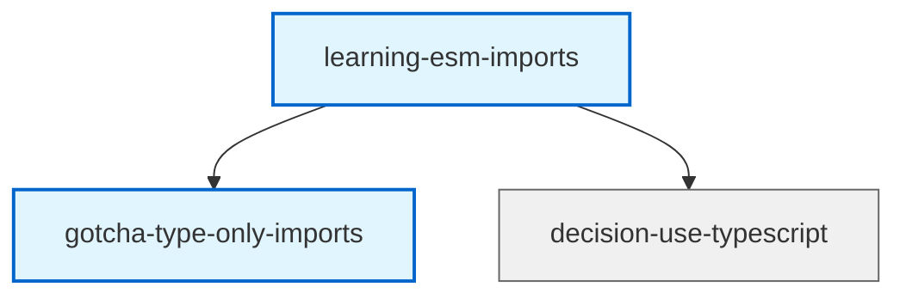

# CLI Command Contracts: Agent-Scoped Memories

**Feature**: 003-agent-scoped-memories
**Version**: 1.0.0

---

## Overview

All existing memory CLI commands extended with `--agent <name>` flag. Backward compatibility guaranteed: commands without `--agent` behave identically to v1.2.0.

---

## Common Parameters

### Agent Flag

**Flag**: `--agent <name>`
**Type**: string
**Required**: No
**Default**: undefined (operates on project/global scope)

**Behaviour**:
- When present: Scopes operation to specified agent's memory namespace
- When absent: Operates on project/global scope (existing behaviour)

**Examples**:
```bash
memory list --agent typescript-expert
memory search "patterns" --agent rust-expert
memory write "Title" --type learning --agent api-architect
```

**Validation**:
- Agent name sanitised automatically (see research.md)
- Sanitised name must be non-empty
- Reserved names rejected (`project`, `global`, `local`, `enterprise`)

---

## Modified Commands

### 1. memory write

**Purpose**: Create or update a memory in agent scope

**Syntax**:
```bash
memory write [OPTIONS]
```

**New Options**:
| Flag | Type | Required | Default | Description |
|------|------|----------|---------|-------------|
| `--agent` | string | No | undefined | Agent name for scoped storage |

**Behaviour Changes**:
- **With `--agent`**: Memory stored in `.claude/memory/agents/{agent}/permanent/` (or global agent directory if outside git)
- **Without `--agent`**: Existing behaviour (project or global scope based on git context)

**Examples**:
```bash
# Agent-scoped memory (project)
memory write \
  --title "ESM imports require .js extensions" \
  --type learning \
  --agent typescript-expert \
  --tags "typescript,esm" \
  --content "When using ES modules in TypeScript..."

# Agent-scoped memory (global, outside git)
cd /tmp
memory write \
  --title "General pattern" \
  --type artifact \
  --agent typescript-expert \
  --scope global

# Existing behaviour (no agent)
memory write --title "Project decision" --type decision
```

**Frontmatter Output**:
```yaml
---
id: learning-esm-imports
type: learning
title: ESM imports require .js extensions
tags: [typescript, esm]
created: 2026-02-01T10:30:00Z
updated: 2026-02-01T10:30:00Z
scope: agent-project
agent: typescript-expert
severity: high
---
```

**Response** (JSON mode with `--json`):
```json
{
  "status": "success",
  "memory": {
    "id": "learning-esm-imports",
    "filePath": "/path/to/.claude/memory/agents/typescript-expert/permanent/learning-esm-imports.md",
    "frontmatter": { "id": "learning-esm-imports", ... },
    "scope": "agent-project"
  }
}
```

---

### 2. memory read

**Purpose**: Read a memory from agent scope

**Syntax**:
```bash
memory read <memory-id> [OPTIONS]
```

**New Options**:
| Flag | Type | Required | Default | Description |
|------|------|----------|---------|-------------|
| `--agent` | string | No | undefined | Agent name for scoped lookup |

**Behaviour Changes**:
- **With `--agent`**: Looks up memory in agent scope only
- **Without `--agent`**: Existing behaviour (project/global hierarchy)

**Examples**:
```bash
# Read from agent scope
memory read learning-esm-imports --agent typescript-expert

# Existing behaviour
memory read decision-api-design
```

**Response**:
```
╔══════════════════════════════════════════════════════════════════╗
║ learning-esm-imports                      [agent-project:typescript-expert]
╠══════════════════════════════════════════════════════════════════╣
║ Type: learning                                                    ║
║ Tags: typescript, esm                                            ║
║ Created: 2026-02-01 10:30                                        ║
║ Updated: 2026-02-01 10:30                                        ║
╠══════════════════════════════════════════════════════════════════╣
║                                                                  ║
║ When using ES modules in TypeScript, imports must include       ║
║ the .js extension even for .ts files...                         ║
║                                                                  ║
╚══════════════════════════════════════════════════════════════════╝
```

**Error Cases**:
```bash
memory read nonexistent --agent typescript-expert
# Error: Memory not found in agent scope 'typescript-expert': nonexistent

memory read learning-esm-imports
# Error: Memory not found: learning-esm-imports
# (correct: it's in agent scope, not project scope)
```

---

### 3. memory list

**Purpose**: List memories in agent scope

**Syntax**:
```bash
memory list [type] [OPTIONS]
```

**New Options**:
| Flag | Type | Required | Default | Description |
|------|------|----------|---------|-------------|
| `--agent` | string | No | undefined | Agent name for scoped listing |

**Behaviour Changes**:
- **With `--agent`**: Lists only agent's memories
- **Without `--agent`**: Existing behaviour (project/global memories)

**Examples**:
```bash
# List all agent memories
memory list --agent typescript-expert

# List agent gotchas
memory list gotcha --agent typescript-expert

# List with tags
memory list --agent rust-expert --tag ownership

# Existing behaviour
memory list learning
```

**Response**:
```
Agent: typescript-expert (agent-project scope)
Total: 3 memories

learning-esm-imports                ESM imports require .js extensions
  Tags: typescript, esm             Created: 2026-02-01 10:30

gotcha-type-only-imports           Type-only imports need isolatedModules
  Tags: typescript, gotcha          Created: 2026-02-01 11:45
  Severity: HIGH

artifact-validation-helper         Zod schema validation pattern
  Tags: typescript, validation      Created: 2026-02-01 12:00
```

---

### 4. memory delete

**Purpose**: Delete a memory from agent scope

**Syntax**:
```bash
memory delete <memory-id> [OPTIONS]
```

**New Options**:
| Flag | Type | Required | Default | Description |
|------|------|----------|---------|-------------|
| `--agent` | string | No | undefined | Agent name for scoped deletion |

**Behaviour Changes**:
- **With `--agent`**: Deletes from agent scope, cleans up cross-scope links
- **Without `--agent`**: Existing behaviour

**Cross-Scope Cleanup**:
When deleting an agent memory that has links to project/global memories, the reverse edges are automatically removed from those scopes' graphs.

**Examples**:
```bash
# Delete from agent scope
memory delete learning-esm-imports --agent typescript-expert

# With cross-scope cleanup report
memory delete artifact-validation --agent typescript-expert
# Output:
# Deleted: artifact-validation
# Cleaned up 2 cross-scope links:
#   - project:decision-api-design
#   - agent:rust-expert:learning-validation
```

---

### 5. memory search

**Purpose**: Full-text search within agent scope

**Syntax**:
```bash
memory search <query> [OPTIONS]
```

**New Options**:
| Flag | Type | Required | Default | Description |
|------|------|----------|---------|-------------|
| `--agent` | string | No | undefined | Agent name for scoped search |
| `--include-shared` | boolean | No | false | Include project/global memories in results |

**Behaviour Changes**:
- **With `--agent`**: Searches only agent's memories
- **With `--agent --include-shared`**: Searches agent + project + global (hierarchy order)
- **Without `--agent`**: Existing behaviour

**Examples**:
```bash
# Search agent scope only
memory search "typescript patterns" --agent typescript-expert

# Search agent + shared scopes
memory search "API design" --agent typescript-expert --include-shared

# Existing behaviour
memory search "database"
```

**Response**:
```
Found 3 matches in agent scope 'typescript-expert':

[agent-project] learning-esm-imports
  ESM imports require .js extensions
  Match: "...TypeScript patterns for ES modules..."

[agent-global] artifact-validation
  Zod schema validation pattern
  Match: "...TypeScript validation using Zod..."

--- Shared Scope (--include-shared) ---

[project] decision-use-typescript
  Use TypeScript for type safety
  Match: "...TypeScript provides compile-time guarantees..."
```

---

### 6. memory semantic

**Purpose**: Semantic search using embeddings within agent scope

**Syntax**:
```bash
memory semantic <query> [OPTIONS]
```

**New Options**:
| Flag | Type | Required | Default | Description |
|------|------|----------|---------|-------------|
| `--agent` | string | No | undefined | Agent name for scoped search |
| `--include-shared` | boolean | No | false | Include project/global embeddings |

**Behaviour Changes**:
- **With `--agent`**: Uses agent's embeddings.json
- **With `--agent --include-shared`**: Merges agent + project + global embeddings
- **Without `--agent`**: Existing behaviour

**Examples**:
```bash
# Semantic search in agent scope
memory semantic "How do I handle async errors?" --agent typescript-expert

# Include shared knowledge
memory semantic "API authentication" --agent typescript-expert --include-shared
```

**Implementation Note**: Agent embeddings are stored separately in `agents/{name}/embeddings.json`, creating isolated vector spaces per agent.

---

### 7. memory link

**Purpose**: Create a link between memories (supports cross-scope)

**Syntax**:
```bash
memory link <source> <target> [OPTIONS]
```

**New Options**:
| Flag | Type | Required | Default | Description |
|------|------|----------|---------|-------------|
| `--agent` | string | No | undefined | Agent scope for source memory |
| `--target-agent` | string | No | undefined | Agent scope for target memory |

**Behaviour Changes**:
- **With `--agent`**: Source is agent-scoped
- **With `--target-agent`**: Target is agent-scoped
- **Both specified**: Links two agent memories (same or different agents)
- **Cross-scope**: Automatically stores link in both graphs with metadata

**Examples**:
```bash
# Link within agent scope (same-scope)
memory link learning-esm-imports gotcha-type-only-imports \
  --agent typescript-expert

# Link agent memory to project memory (cross-scope)
memory link learning-esm-imports decision-use-typescript \
  --agent typescript-expert

# Link between agents (cross-agent)
memory link learning-esm-imports learning-ownership \
  --agent typescript-expert \
  --target-agent rust-expert

# Existing behaviour (project scope)
memory link decision-api-design artifact-validation
```

**Cross-Scope Edge Storage**:
```json
// In agent graph (.claude/memory/agents/typescript-expert/graph.json)
{
  "source": "learning-esm-imports",
  "target": "decision-use-typescript",
  "label": "relates-to",
  "sourceScope": "agent-project",
  "targetScope": "project"
}

// In project graph (.claude/memory/graph.json)
{
  "source": "decision-use-typescript",
  "target": "learning-esm-imports",
  "label": "relates-to",
  "sourceScope": "project",
  "targetScope": "agent-project",
  "targetAgent": "typescript-expert"
}
```

---

### 8. memory unlink

**Purpose**: Remove a link between memories

**Syntax**:
```bash
memory unlink <source> <target> [OPTIONS]
```

**New Options**:
| Flag | Type | Required | Default | Description |
|------|------|----------|---------|-------------|
| `--agent` | string | No | undefined | Agent scope for source memory |
| `--target-agent` | string | No | undefined | Agent scope for target memory |

**Behaviour Changes**:
- Automatically removes cross-scope edges from both graphs

**Examples**:
```bash
# Unlink cross-scope
memory unlink learning-esm-imports decision-use-typescript \
  --agent typescript-expert

# Unlink within agent scope
memory unlink learning-a learning-b --agent typescript-expert
```

---

### 9. memory edges

**Purpose**: View all links for a memory

**Syntax**:
```bash
memory edges <memory-id> [OPTIONS]
```

**New Options**:
| Flag | Type | Required | Default | Description |
|------|------|----------|---------|-------------|
| `--agent` | string | No | undefined | Agent scope for memory |

**Behaviour Changes**:
- **With `--agent`**: Shows agent memory's edges with scope indicators

**Examples**:
```bash
memory edges learning-esm-imports --agent typescript-expert
```

**Response**:
```
Edges for learning-esm-imports [agent-project:typescript-expert]

Outbound (3):
  → gotcha-type-only-imports [agent-project] (relates-to)
  → decision-use-typescript [project] (informs)
  → learning-ownership [agent:rust-expert] (relates-to)

Inbound (1):
  ← artifact-validation [agent-project] (exemplifies)
```

**Scope Indicator Format**:
- `[agent-project]` - Same agent, project scope
- `[agent-global]` - Same agent, global scope
- `[project]` - Project scope (cross-scope)
- `[agent:rust-expert]` - Different agent (cross-agent)

---

### 10. memory mermaid

**Purpose**: Generate Mermaid graph diagram

**Syntax**:
```bash
memory mermaid [OPTIONS]
```

**New Options**:
| Flag | Type | Required | Default | Description |
|------|------|----------|---------|-------------|
| `--agent` | string | No | undefined | Agent scope for graph |
| `--include-shared` | boolean | No | false | Include project/global nodes |

**Behaviour Changes**:
- **With `--agent`**: Generates agent-only graph
- **With `--agent --include-shared`**: Includes cross-scope links with visual distinction

**Examples**:
```bash
# Agent graph only
memory mermaid --agent typescript-expert

# Agent + shared knowledge
memory mermaid --agent typescript-expert --include-shared
```

**Response** (with visual distinction):


**Visual Styling**:
- Agent nodes: Blue background, thick border
- Project nodes: Grey background, thin border
- Cross-scope edges: Dashed lines (optional enhancement)

---

### 11. memory stats

**Purpose**: Graph statistics

**Syntax**:
```bash
memory stats [OPTIONS]
```

**New Options**:
| Flag | Type | Required | Default | Description |
|------|------|----------|---------|-------------|
| `--agent` | string | No | undefined | Agent scope for statistics |

**Behaviour Changes**:
- **With `--agent`**: Statistics for agent scope only

**Examples**:
```bash
memory stats --agent typescript-expert
```

**Response**:
```
Graph Statistics: typescript-expert (agent-project)

Nodes: 15
Edges: 23
Orphans: 2
Average degree: 1.53
Most connected: learning-async-patterns (8 edges)

Cross-scope links: 5
  → project: 3
  → agent:rust-expert: 2
```

---

### 12. memory health

**Purpose**: Validate memory system integrity

**Syntax**:
```bash
memory health [OPTIONS]
```

**New Options**:
| Flag | Type | Required | Default | Description |
|------|------|----------|---------|-------------|
| `--agent` | string | No | undefined | Agent scope for health check |

**Behaviour Changes**:
- **With `--agent`**: Validates agent scope integrity
- Checks cross-scope link validity

**Examples**:
```bash
memory health --agent typescript-expert
```

**Response**:
```
Health Check: typescript-expert (agent-project)

✓ Directory structure valid
✓ Index file valid (15 entries)
✓ Graph file valid (15 nodes, 23 edges)
✓ All memory files readable
✓ Frontmatter valid (agent field present in all)
✓ Cross-scope links valid (5 links verified)

⚠ 2 orphaned nodes:
  - learning-old-pattern
  - gotcha-deprecated

Status: HEALTHY (warnings)
```

---

## New Commands

### memory agents

**Purpose**: List all agents with memory counts

**Syntax**:
```bash
memory agents [OPTIONS]
```

**Options**:
| Flag | Type | Required | Default | Description |
|------|------|----------|---------|-------------|
| `--scope` | string | No | project | Scope to search (project/global/both) |
| `--json` | boolean | No | false | Output JSON format |

**Behaviour**:
- Scans `.claude/memory/agents/` and `~/.claude/memory/agents/`
- Reports memory counts per agent

**Examples**:
```bash
# List all agents
memory agents

# List global agents only
memory agents --scope global

# JSON output
memory agents --json
```

**Response**:
```
Agents (project scope):

typescript-expert
  Memories: 15
  Gotchas: 3
  Last updated: 2026-02-01 12:00

rust-expert
  Memories: 8
  Learnings: 5
  Last updated: 2026-01-31 15:30

Agents (global scope):

api-architect
  Memories: 23
  Decisions: 10
  Last updated: 2026-02-01 10:00

Total: 3 agents, 46 memories
```

**JSON Response**:
```json
{
  "project": [
    {
      "name": "typescript-expert",
      "path": ".claude/memory/agents/typescript-expert",
      "memoryCount": 15,
      "typeCounts": { "learning": 8, "gotcha": 3, "artifact": 4 },
      "lastUpdated": "2026-02-01T12:00:00Z"
    }
  ],
  "global": [
    {
      "name": "api-architect",
      "path": "/home/user/.claude/memory/agents/api-architect",
      "memoryCount": 23,
      "typeCounts": { "decision": 10, "learning": 13 },
      "lastUpdated": "2026-02-01T10:00:00Z"
    }
  ]
}
```

---

## Backward Compatibility Guarantees

### All Commands Without `--agent` Flag

**Guarantee**: Identical behaviour to v1.2.0

**Test Coverage**:
- Every command tested with and without `--agent` flag
- Without `--agent`: Assertions against v1.2.0 expected output
- No agent-scoped memories visible in default operations

**Examples of Unchanged Behaviour**:
```bash
# These commands work exactly as before
memory list
memory search "pattern"
memory read decision-api
memory write --title "Note" --type learning
memory link source target
memory mermaid
```

---

## Error Handling

### Agent Not Found

```bash
memory read learning-x --agent nonexistent-agent
# Error: No memories found for agent 'nonexistent-agent'
```

### Memory Not Found in Agent Scope

```bash
memory read project-memory --agent typescript-expert
# Error: Memory not found in agent scope 'typescript-expert': project-memory
# Hint: This memory exists in project scope. Omit --agent flag to access it.
```

### Invalid Agent Name

```bash
memory write "Title" --type learning --agent "Invalid Name!!!"
# Warning: Agent name sanitised: 'Invalid Name!!!' → 'invalid-name'
# Proceeding with agent: invalid-name
```

### Cross-Scope Link Target Not Found

```bash
memory link learning-a nonexistent-target --agent typescript-expert
# Error: Target memory not found: nonexistent-target
# Searched in: agent-project (typescript-expert), project, global
```

---

## CLI Help Text Updates

### memory help write

```
memory write [OPTIONS]

Create or update a memory.

Options:
  --title <string>        Memory title (required)
  --type <type>          Memory type: decision, learning, gotcha, artifact (required)
  --content <string>     Markdown content (or read from stdin)
  --tags <tag1,tag2>     Comma-separated tags
  --severity <level>     Severity: low, medium, high, critical
  --scope <scope>        Storage scope: project, global, local (default: auto)
  --agent <name>         Agent scope for memory storage (new in v1.3.0)
  --auto-link            Automatically link to similar memories
  --json                 Output JSON format

Examples:
  memory write --title "API pattern" --type learning --agent typescript-expert
  memory write --title "Decision" --type decision --content "We chose..."
```

---

**Contract Version**: 1.0.0
**Backward Compatibility**: v1.2.0 command behaviour preserved
