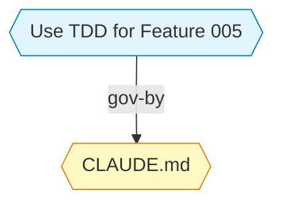

# Quickstart: Rule and Reminder Graph Nodes

**Purpose**: Validate implementation against success criteria through step-by-step scenarios.

---

## Scenario 1: Rule File Discovery and Indexing

**Goal**: Validates FR-001 through FR-008 (rule discovery, indexing, embedding generation)

**Setup**:
1. Create test project structure:
```bash
mkdir -p /tmp/test-project/.claude/rules
cd /tmp/test-project
git init
```

2. Create CLAUDE.md at project root:
```bash
cat > CLAUDE.md << 'EOF'
# Project Instructions

- Always use British English
- Follow TDD principles (Red-Green-Refactor)
- No wrapper abstractions unless justified
EOF
```

3. Create rule file in .claude/rules/:
```bash
cat > .claude/rules/security.md << 'EOF'
# Security Rules

- Never commit secrets to git
- Use environment variables for API keys
- Validate all user input
EOF
```

**Steps**:
1. Run sync:
```bash
memory sync
```

**Expected Outcome**:
```json
{
  "status": "success",
  "changes": {
    "addedToGraph": ["rule-project-claude-md", "rule-project-security"],
    "addedToIndex": ["rule-project-claude-md", "rule-project-security"]
  },
  "summary": {
    "filesOnDisk": 0,
    "nodesInGraph": 2,
    "entriesInIndex": 2,
    "entriesInEmbeddings": 2
  }
}
```

2. Verify graph contains rule nodes:
```bash
memory list rule
```

**Expected Output**:
```
[rule] rule-project-claude-md
[rule] rule-project-security
```

3. Test semantic search:
```bash
memory semantic "no wrapper abstractions" --threshold 0.4
```

**Expected Output** (CLAUDE.md rule should appear):
```
Semantic matches for: "no wrapper abstractions"

[0.67] rule-project-claude-md (rule)
       CLAUDE.md - project scope
       "...No wrapper abstractions unless justified..."
```

**Validation Criteria**:
- ✅ Both rule files discovered and indexed
- ✅ Nodes have type='rule'
- ✅ Semantic search returns CLAUDE.md rule with similarity > 0.45
- ✅ No errors during sync

---

## Scenario 2: Reminder File Discovery and Indexing

**Goal**: Validates FR-004, FR-010 (reminder discovery, agent scope handling)

**Setup**:
1. Create agent-memory directory structure:
```bash
mkdir -p .claude/agent-memory/curator
```

2. Create MEMORY.md for curator agent:
```bash
cat > .claude/agent-memory/curator/MEMORY.md << 'EOF'
# Curator Agent Memory

## Key Learnings

- Memory linking prevents orphaned nodes
- TDD stub pattern accelerates hook compliance
- Graph health score above 0.7 indicates good connectivity
EOF
```

3. Create sub-file:
```bash
cat > .claude/agent-memory/curator/patterns.md << 'EOF'
# Common Patterns

## TDD Workflow
1. Write failing test
2. Implement minimum code
3. Refactor
EOF
```

**Steps**:
1. Run sync:
```bash
memory sync
```

**Expected Outcome**:
```json
{
  "changes": {
    "addedToGraph": ["reminder-project-curator-memory", "reminder-project-curator-patterns"]
  }
}
```

2. List reminder nodes:
```bash
memory list reminder
```

**Expected Output**:
```
[reminder] reminder-project-curator-memory (agent: curator)
[reminder] reminder-project-curator-patterns (agent: curator)
```

3. Search within agent scope:
```bash
memory semantic "TDD patterns" --agent curator --include-shared
```

**Expected Output** (reminder nodes should appear):
```
[0.72] reminder-project-curator-patterns (reminder, agent: curator)
[0.58] reminder-project-curator-memory (reminder, agent: curator)
```

**Validation Criteria**:
- ✅ Both reminder files discovered
- ✅ Nodes have type='reminder' and agent='curator'
- ✅ Semantic search scoped to agent returns relevant reminders
- ✅ AgentProject scope correctly assigned

---

## Scenario 3: Read-Only Node Protection

**Goal**: Validates FR-015 (mutating operations rejected on external nodes)

**Setup**: Use rule node from Scenario 1 (rule-project-claude-md)

**Steps**:

1. Attempt to delete rule node:
```bash
memory delete rule-project-claude-md
```

**Expected Outcome**:
```
Error: 'rule-project-claude-md' is a read-only external node. Run 'memory sync' to refresh it.
```

2. Attempt to rename rule node:
```bash
memory rename rule-project-claude-md new-id
```

**Expected Outcome**:
```
Error: 'rule-project-claude-md' is a read-only external node. Run 'memory sync' to refresh it.
```

3. Attempt to promote rule node:
```bash
memory promote rule-project-claude-md decision
```

**Expected Outcome**:
```
Error: 'rule-project-claude-md' is a read-only external node. Run 'memory sync' to refresh it.
```

4. Verify read operations work:
```bash
memory read rule-project-claude-md
```

**Expected Output** (full CLAUDE.md content):
```markdown
---
id: rule-project-claude-md
type: rule
title: CLAUDE.md
scope: project
externalPath: /tmp/test-project/CLAUDE.md
---

# Project Instructions

- Always use British English
- Follow TDD principles (Red-Green-Refactor)
- No wrapper abstractions unless justified
```

**Validation Criteria**:
- ✅ All mutating commands (delete, rename, promote) rejected with clear error
- ✅ Error message guides user to correct action (run sync)
- ✅ Read operations succeed and show full content from externalPath

---

## Scenario 4: Graph Visualisation and Linking

**Goal**: Validates FR-017, FR-018, FR-019 (Mermaid rendering, edge creation)

**Setup**: Create a decision memory and link it to rule from Scenario 1

**Steps**:

1. Create decision memory:
```bash
echo '{
  "type": "decision",
  "title": "Use TDD for Feature 005",
  "content": "Feature 005 will follow TDD workflow to ensure comprehensive test coverage.",
  "tags": ["tdd", "feature-005"]
}' | memory write
```

**Expected Output**:
```
Created memory: decision-use-tdd-for-feature-005
```

2. Link decision to rule:
```bash
memory link decision-use-tdd-for-feature-005 rule-project-claude-md governed-by
```

**Expected Outcome**:
```
Created edge: decision-use-tdd-for-feature-005 --governed-by--> rule-project-claude-md
```

3. Generate Mermaid diagram:
```bash
memory mermaid --show-all
```

**Expected Output** (partial, showing relevant nodes):


4. Verify rule node shape is hexagon:
```bash
memory mermaid --show-all | grep -A1 "rule_project_claude_md"
```

**Expected Output**:
```
  rule_project_claude_md{{"CLAUDE.md"}}
```
(Note: `{{ }}` is hexagon shape in Mermaid)

5. Verify edges for rule node:
```bash
memory edges rule-project-claude-md
```

**Expected Output**:
```
Inbound edges:
  decision-use-tdd-for-feature-005 --governed-by--> rule-project-claude-md

Outbound edges:
  (none)
```

**Validation Criteria**:
- ✅ Link command succeeds (rule nodes are valid link targets)
- ✅ Mermaid renders rule node with hexagon shape `{{ }}`
- ✅ Edge label "governed-by" visible in diagram
- ✅ Distinct colour for rule nodes (different from decision nodes)
- ✅ `memory edges` correctly lists relationships

---

## Scenario 5: Content Change Detection

**Goal**: Validates FR-011 (content hash-based embedding invalidation)

**Setup**: Use CLAUDE.md from Scenario 1

**Steps**:

1. Check initial embedding:
```bash
cat .claude/memory/embeddings.json | jq '.memories["rule-project-claude-md"]'
```

**Expected Output**:
```json
{
  "embedding": [0.123, -0.456, ...],
  "hash": "a1b2c3d4e5f6g7h8",
  "timestamp": "2026-02-19T04:00:00.000Z"
}
```

2. Modify CLAUDE.md:
```bash
echo "- Use semantic commit messages" >> CLAUDE.md
```

3. Run sync again:
```bash
memory sync
```

**Expected Outcome**:
```json
{
  "changes": {
    "updatedNodes": ["rule-project-claude-md"]
  }
}
```

4. Verify embedding regenerated:
```bash
cat .claude/memory/embeddings.json | jq '.memories["rule-project-claude-md"]'
```

**Expected Output** (hash should be different):
```json
{
  "embedding": [0.789, 0.234, ...],
  "hash": "9i8j7k6l5m4n3o2p",
  "timestamp": "2026-02-19T04:10:00.000Z"
}
```

**Validation Criteria**:
- ✅ Content hash changes after file modification
- ✅ Embedding regenerated (new hash, new timestamp)
- ✅ Sync reports node as updated
- ✅ Semantic search reflects new content

---

## Scenario 6: Targeted Context Re-Indexing

**Goal**: Validates FR-013, FR-014 (memory index-context command, scope filtering)

**Setup**: Use project from Scenario 1 with existing rule nodes

**Steps**:

1. Modify CLAUDE.md:
```bash
echo "- Document all public APIs" >> CLAUDE.md
```

2. Run targeted re-index (NOT full sync):
```bash
memory index-context
```

**Expected Outcome**:
```json
{
  "status": "success",
  "changes": {
    "updatedNodes": ["rule-project-claude-md"]
  },
  "duration": "1.2s"
}
```

3. Verify faster than full sync (no orphan reconciliation):
```bash
time memory index-context
# vs
time memory sync
```

**Expected**: `index-context` completes in <5s, faster than `sync`

4. Test scope filtering:
```bash
memory index-context --scope project
```

**Expected**: Only project-scope rules re-indexed (skips global rules if any exist)

**Validation Criteria**:
- ✅ index-context command exists and executes
- ✅ Updates external nodes without full reconciliation
- ✅ Completes faster than full sync
- ✅ --scope flag filters re-indexing correctly
- ✅ Embeddings updated for changed files

---

## Scenario 7: File Deletion Handling

**Goal**: Validates FR-022 (stale node removal when file deleted)

**Setup**: Use rule file from Scenario 1

**Steps**:

1. Verify rule node exists:
```bash
memory list rule | grep security
```

**Expected Output**:
```
[rule] rule-project-security
```

2. Delete the rule file:
```bash
rm .claude/rules/security.md
```

3. Run sync:
```bash
memory sync
```

**Expected Outcome**:
```json
{
  "changes": {
    "removedNodes": ["rule-project-security"]
  }
}
```

4. Verify node removed from graph:
```bash
memory list rule | grep security
```

**Expected Output**: (empty - node no longer exists)

5. Verify embedding removed:
```bash
cat .claude/memory/embeddings.json | jq '.memories["rule-project-security"]'
```

**Expected Output**: `null`

**Validation Criteria**:
- ✅ Deleted file detected during sync
- ✅ Node removed from graph
- ✅ Index entry removed
- ✅ Embedding removed
- ✅ No orphan edges remain (if file was linked)

---

## Scenario 8: Ancestor CLAUDE.md Discovery

**Goal**: Validates FR-002 (directory tree walking for CLAUDE.md)

**Setup**: Create nested project structure with CLAUDE.md files at multiple levels

**Steps**:

1. Create directory structure:
```bash
mkdir -p /tmp/workspace/parent-project
cd /tmp/workspace
echo "# Workspace Rules" > CLAUDE.md
cd parent-project
echo "# Parent Project Rules" > CLAUDE.md
mkdir child-project
cd child-project
git init
```

2. Run sync from child-project:
```bash
cd /tmp/workspace/parent-project/child-project
memory sync
```

**Expected Outcome**:
```json
{
  "changes": {
    "addedToGraph": [
      "rule-project-claude-md",           // child-project/CLAUDE.md (doesn't exist, skip)
      "rule-ancestor-1-claude-md",        // parent-project/CLAUDE.md
      "rule-ancestor-2-claude-md"         // workspace/CLAUDE.md
    ]
  }
}
```

3. Verify scope determination:
```bash
memory list rule --json | jq '.[] | {id, scope}'
```

**Expected Output**:
```json
[
  {"id": "rule-ancestor-1-claude-md", "scope": "global"},
  {"id": "rule-ancestor-2-claude-md", "scope": "global"}
]
```
(Both above git root, so global scope)

**Validation Criteria**:
- ✅ Walks directory tree from cwd to home
- ✅ Discovers CLAUDE.md at multiple ancestor levels
- ✅ Generates unique IDs (ancestor-N prefix)
- ✅ Correct scope determination (above git root = global)
- ✅ No duplicate indexing

---

## Scenario 9: Graceful Ollama Fallback

**Goal**: Validates FR-008 (embedding generation with graceful fallback)

**Setup**: Stop Ollama service to simulate unavailability

**Steps**:

1. Stop Ollama:
```bash
systemctl stop ollama  # or: pkill ollama
```

2. Create new rule file:
```bash
echo "# API Design Rules" > .claude/rules/api.md
```

3. Run sync:
```bash
memory sync
```

**Expected Outcome**:
```json
{
  "status": "success",
  "changes": {
    "addedToGraph": ["rule-project-api"],
    "addedToIndex": ["rule-project-api"]
  },
  "warnings": [
    "Ollama unavailable - skipping embedding generation. Run 'memory index-context' after Ollama is restored."
  ]
}
```

4. Verify node indexed without embedding:
```bash
cat .claude/memory/embeddings.json | jq '.memories["rule-project-api"]'
```

**Expected Output**: `null` (no embedding)

5. Verify node still searchable by keyword:
```bash
memory search "API"
```

**Expected Output**:
```
[rule] rule-project-api
       API Design Rules
```

6. Restart Ollama and re-index:
```bash
systemctl start ollama
memory index-context
```

**Expected Outcome**: Embedding now generated

**Validation Criteria**:
- ✅ Sync succeeds even when Ollama unavailable
- ✅ Node indexed in graph and index
- ✅ Warning message guides user to resolution
- ✅ Keyword search still works (no embedding required)
- ✅ Embedding generated on subsequent index-context after Ollama restored

---

## Scenario 10: Quality Audit Exclusion

**Goal**: Validates FR-021 (rule/reminder nodes excluded from quality scoring)

**Setup**: Use rule node from Scenario 1

**Steps**:

1. Run quality audit:
```bash
memory audit --threshold 0.5
```

**Expected Output** (rule nodes should NOT appear):
```
Quality Audit Report
Threshold: 0.5

Memories below threshold:
(none)

Summary:
- Total memories: 10
- Evaluated: 8
- Excluded: 2 (external files)
- Below threshold: 0
```

2. Verify quality command on rule node returns exclusion:
```bash
memory quality rule-project-claude-md
```

**Expected Output**:
```
Memory 'rule-project-claude-md' is an external file and excluded from quality scoring.
```

**Validation Criteria**:
- ✅ External nodes excluded from audit count
- ✅ Quality command explicitly states exclusion
- ✅ No quality score calculated for external nodes
- ✅ Audit summary shows excluded count

---

## Integration Validation

**End-to-End Workflow**:

1. Create project with CLAUDE.md and agent MEMORY.md
2. Run `memory sync`
3. Create decision memory
4. Link decision to rule: `memory link <decision-id> rule-project-claude-md governed-by`
5. Search: `memory semantic "TDD" --threshold 0.4`
6. Visualise: `memory mermaid --show-all`
7. Modify CLAUDE.md
8. Quick refresh: `memory index-context`
9. Verify updated embedding in search results

**Success Criteria**:
- ✅ All steps complete without errors
- ✅ External files discoverable via semantic search
- ✅ Links between memories and rules visible in Mermaid
- ✅ Changes detected and re-indexed efficiently
- ✅ Read-only protection enforced throughout

---

## Performance Benchmarks

**Discovery Performance**:
- 10 external files: <500ms
- 50 external files: <2s
- 100 external files: <5s

**Indexing Performance** (excluding embedding generation):
- 10 external files: <1s
- 50 external files: <3s

**Embedding Generation** (Ollama-dependent):
- Single file (6KB CLAUDE.md): ~200ms
- Batch of 10 files: ~2-3s

**Target**: `memory index-context` completes in <5s for typical project (10 external files).

---

## Cleanup

```bash
rm -rf /tmp/test-project /tmp/workspace
```
